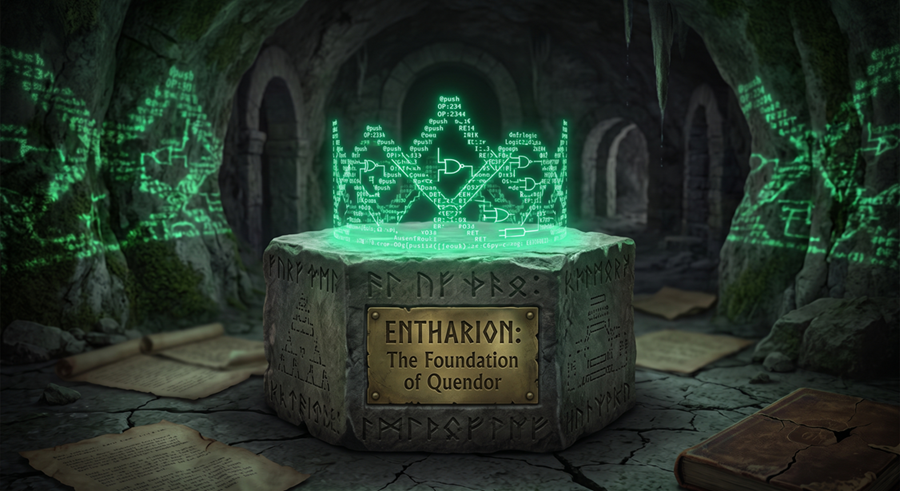

<h1 align="center">
  
</h1>

Long before the Great Underground Empire was defined by the eccentricities of the Flathead dynasty, the bureaucratic efficiency of FrobozzCo, or the perilous, pitch-black caverns where grues roam, there was simply a scattered and untamed land. It was a realm of fragmented magic and chaotic geography waiting for a unifying force. That force arrived in the person of **Entharion the Wise**. As the legendary first king, Entharion conquered the chaos, united the warring factions, and laid the literal and legal foundations for the kingdom of **Quendor**.

In the context of this software ecosystem, this repository serves an identical purpose.

Building a robust Z-Machine interpreter is an exercise in taming decades of scattered documentation, intricate specification files, and nuanced historical edge cases. This repository is the foundational realm where that chaos is conquered. It acts as the central hub for all the resources, tests, and reference materials required to build a compliant virtual machine. Just as the historical king established the stability necessary for an empire to rise, this repository provides the structural bedrock that allows [Quendor](https://github.com/jeffnyman/quendor), my actual Z-Machine interpreter application, to be successfully realized. Here, the foundations are laid so that the empire of text adventures can safely run.