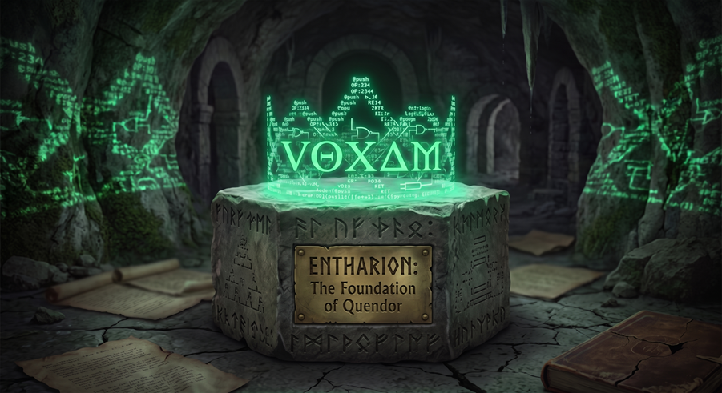

<h1 align="center">
  
</h1>

Long before the Great Underground Empire was defined by the eccentricities of the Flathead dynasty, the bureaucratic efficiency of FrobozzCo, or the perilous, pitch-black caverns where grues roam, there was simply a scattered and untamed land. It was a realm of fragmented magic and chaotic geography waiting for a unifying force. That force arrived in the person of **Entharion the Wise**. As the legendary first king, Entharion conquered the chaos, united the warring factions, and laid the literal and legal foundations for the kingdom of **Quendor**.

In the context of this software ecosystem, this repository serves an identical purpose.

Building a robust Z-Machine interpreter is an exercise in taming decades of scattered documentation, intricate specification files, and nuanced historical edge cases. This repository is the foundational realm where that chaos is conquered. It acts as the central hub for all the resources, tests, and reference materials required to build a compliant virtual machine. Just as the historical king established the stability necessary for an empire to rise, this repository provides the structural bedrock that allows [Quendor](https://github.com/jeffnyman/quendor), my actual Z-Machine interpreter application, to be successfully realized. Here, the foundations are laid so that the empire of text adventures can safely run.

---

# Contents

This repository contains a lot of binaries for Infocom and Inform text adventures. It also contains a great deal of source code for many of those games. In the list below you will see reference to "MP" and this refers to the "Masterpieces" versions, more specifically those versions that appeared on the _The Text Adventure Masterpieces of Infocom_ CD collection released in 1996. You will also see reference to either "LTOI1" or and these refer to the _Lost Treasures of Infocom 1 and 2_, which were a collection released by Activisoin in 1992. Those two distributions each had some oddities. The Mac and PC directories on the Masterpieces CD ended up shipping with different versions. It was also the case that _Hitchhiker's Guide to the Galaxy_ and _Shogun_. The LOTOI series also had different choices of versions for the various games but, on the other, did include the games missing from Masterpieces. What's also interesting is that LTOI1 was released for the Amiga as well, and that mattered in terms of the some of the differences that the Amiga versions provided.

You will also see reference to "Solid Gold" and the context here is that a few of Infocom's earlier games were re-released under this branding, taking advantage of the version 5 features but also being distributed with in game clus (called "Invisiclues"). These versions used ".z5" format in order to accomodate the additional text.

There are certain versions where the only source code available was for the so-called "final dev" (FD) versions. These were actually entirely unreleased versions, usually with changes being made to them when Infocom's development team was effectively shuttered.

You will also see me reference "resource blorb provided" for some games. The context here is that games with sound (_Sherlock_ and _The Lurking Horror_) and graphics (the z6 games) require having those sounds or graphics packaged in a way that a modern interpreter can actually read them. I have included all such files here (sourced from the [if-archive](https://ifarchive.org/indexes/if-archive/infocom/media/).)

The Infocom games cover the range of Z-Machine versions from 1 to 6. In 1995, Graham Nelson proposed versions 7 and 8 as modifications that would support larger game files, and this was in service of his Inform compiler, which served as a re-implementation of Infocom's toolset.

As a final note, I will say that while the source code for all Inform games is pulled from public archives, where the authors have chosen to distribute their source code, the source code for Infocom games is, technically, proprietary. I say technically because while the copyright rests with Microsoft (previously Activision), the source has been available for a long time, much of it being archived on the [Historical Source](https://github.com/historicalsource/) repo. This, by itself, doesn't make it legal but Microsoft, and Activision before them, never really seemed to care. In fact, Microsoft has declared that _Zork 1_, _Zork 2_, and _Zork 3_ are open source. ([Source](https://opensource.microsoft.com/blog/2025/11/20/preserving-code-that-shaped-generations-zork-i-ii-and-iii-go-open-source)) That does not translate to the other games but, what this shows, is that Microsoft is clearly aware of the material that is out there and has chosen not to take any action.

## 3rd Party Tooling

I am providing a submodule to my own distribution of [ztools](https://github.com/jeffnyman/ztools/). I'm doing this rather than providing executables because this will allow anyone to simply compile from source. The same applies to Frotz, although here I link directly to David Griffith's [Frotz](https://gitlab.com/DavidGriffith/frotz). Annoyingly, that project is on GitLab, which makes the direct link often not resolve but the submodule always should. Again, this can be built from source.

Finally, rather than directly include Inform 6, I have include my own [Reform 6](https://github.com/jeffnyman/reform6). This should compile Inform files just the way Inform 6 does, but with some additions that I'm playing around with.

## Generating Dump and Disassembly Info

I'm putting this here mainly for myself, because I tend to forget the options I want to pass to ztools when I want to generate the most helpful information for me. Here are the commands I recommend:

```bash
infodump -f file.z3 > file_info.txt
txd -agn file.z3 > file_txd.txt
```

## Infocom

Note that some of these games had various resources, like graphics or sound. The general places to get these is at the [infocom/media/blorb](https://ifarchive.org/indexes/if-archive/infocom/media/blorb/) section of the IFArchive. However, this is a little muddled. Some of these resources were updated for specific interpreters and it's not always clear if it matters what specific zcode binary is used. I have added what I think are the correct files to this repo, naming the resource files the same as the zcode binary they are associated with.

### Zork

There are a lot of _Zork_ versions and they run the gamut from version 1 to version 6, with the exception of verison 4. It's worth it to include some z1 and z2 files even though they are extremely rare. Any interpreter that is specification complete, or even accurate, should be able to play these. Beyond that, these are some of the earliest creation of of _Zork_. It's worth noting that the "r2" file wa apparently pulled from a disk for the TRS-80 Model I.

- zork1-r2-sAS000C.z1
- zork1-r15-sUG3AU5.z2
- zork1-r88-s840726.z3 (MP; source included)
- zork1-invclues-r52-s871125.z5 (Solid Gold; source included)
- zork2-r48-s840904.z3 (MP; source included)
- zork3-r17-s840727.z3 (MP; source included)
- zork0-r366-s890323.z6 (LTOI1, Amiga)
- zork0-r393-s890714.z6 (MP; source included; resource blorb provided)
- beyondzork-r57-s871221.z5 (MP; source included; resource blorb provided)

### Other Games

- amfv-r77-s850814.z4 (MP; source included)
- arthur-r54-s890606.z6 (MP, Mac)
- arthur-r74-s890714.z6 (MP, PC; source included; resource blorb provided)
- ballyhoo-r97-s851218.z3 (MP)
- ballyhoo-r99-s861014.z3 (FD; source included)
- borderzone-r9-s871008.z5 (MP; source included)
- bureaucracy-r116-s870602.z4 (MP)
- bureaucracy-r160-s880521.z4 (FD; source included)
- cutthroats-r23-s840809.z3 (MP; source included)
- deadline-r27-s831005.z3 (MP; source included)
- enchanter-r29-s860820.z3 (MP; source included)
- hitchhiker-r59-s851108.z3 (LTOI1, Mac; BBC version)
- hitchhiker-invclues-r31-s871119.z5 (LTOI1, PC; Solid Gold; source included)
- hollywoodhijinx-r37-s861215.z3 (MP; source included)
- infidel-r22-s830916.z3 (MP; sourec included)
- journey-r26-s890316.z6 (MP, Mac)
- journey-r83-s890706.z6 (MP, PC; source included; resource blorb provided)
- leathergoddesses-r59-s860730.z3 (MP, PC; source included)
- leathergoddesses-invclues-r4-s880405.z5 (MP, Mac; Solid Gold; source included)
- lurkinghorror-r203-s870506.z3 (MP; source included; resource blorb provided)
- lurkinghorror-r219-s870912.z3 (LTOI1; Amiga; resource blorb provided)
- minizork-r2-s840207.z3 (source included)
- minizork-r34-s871124.z3 (source included)
- minizork2-r2-s871123.z3 (source included)
- moonmist-r9-s861022.z3 (MP; source included)
- nordandbert-r19-s870722.z4 (MP; source included)
- planetfall-r37-s851003.z3 (MP, PC; source included)
- planetfall-invclues-r10-s880531.z5 (LTOI1, Mac; MP, Mac; Solid Gold)
- plunderedhearts-r26-s870730.z3 (MP; source included)
- seastalker-r16-s850603.z3 (MP)
- seastalker-r18-s850919.z3 (FD; source included)
- sherlock-r26-s880127.z5 (MP, Mac; source included; resource blorb provided)
- shogun-r292-s890314.z6 (LTOI2, Mac)
- shogun-r322-s890706.z6 (LTOI2, PC; source included; resource blorb provided)
- sorcerer-r13-s851021.z3 (LTOI1, Amiga; source included)
- sorcerer-r15-s851108.z3 (MP)
- sorcerer-r18-s860904.z3 (source included)
- spellbreaker-r87-s860904.z3 (MP; source included)
- stationfall-r107-s870430.z3 (MP; source included)
- starcross-r17-s821021.z3 (MP)
- starcross-r18-s830114.z3 (FD; source included)
- suspect-r14-s841005.z3 (MP; source included)
- suspended-r8-s830521.z3 (LTOI1, Amiga)
- suspended-r8-s840521.z3 (MP, Mac; source included)
- trinity-r12-s860926.z4 (MP; source included)
- wishbringer-r69-s850920.z3 (MP, PC; source included)
- wishbringer-invclues-r23-s880706.z5 (Solid Gold; source included)
- witness-r22-s840924.z3 (MP)
- witness-r23-s840925.z3 (FD; source included)

A few notes:

- Apparently the Solid Gold edition of _Wishbringer_ has related to the delivery time limit. [Bug discussion](https://github.com/the-infocom-files/wishbringer-invclues/issues/7)

- Reports suggest that Mini-Zork 2 fails on modern interpreters when you exit the Carousel Room.

## Inform

_Advent_ comes in variations in this repo. The r9-s060321 edition has source included. The r9-s260512 edition is here simply because it provides three versions of the same story file.

_All Roads_ (allroads-r1-s011119.z5) includes some interesting mechanics that a Z-Machine interpreter has to get right. Unfortunately, the author never released the source code.

_Awakening_ (awakening-r1-s980726.z5) is a nice simple game with an easy walkthrough, making it good to test for a new interpreter.

_Balances_ (balances-r5-s961216.z5; source included) provides a good example of the Inform language's versatility and thus is a good one to check an interpreter against.

_Blue Chairs_ (bluechairs-r2-s041229.z5; source included) has some interesting elements on its title screen and those are good to see if an interpreter renders all of it correctly.

_Bomber_ (bomber-r3-s971123.z5; source included) is a good one because it requires timed out and color is provided, although not required.

_Curses_ (curses-r16-s951024.z5, curses-r17-s210531.z8; source included) is an interesting game. The original source is lost but was recreated. See Allen Garvin's [curses repo](https://github.com/allengarvin/curses). That source is included here, which is for the release 17 revision.

_Custard_ (custard-r1-s000314) is included only because it is one of the very few games compiled to the version 7 format of the Z-Machine.

_Destruct_ (destruct-r1-s030509.z1) is included only because it is one of the very few games compiled to the version 1 format of the Z-Machine.

_All Things Devours_ (devours-r3-s050325.z5; source included) is included because it's a great game and has a very solid walkthrough that is easy to test an interpreter with.

_Bronze_ (bronze-r11-s060503.zblorb; source included) is one of the few Inform 7 games included in this repo. It does some interesting things with the status line that are worth making sure an interpreter can handle.

_Freefall_ (freefall-r2-s951111.z5; source included) is an "abuse" of the Z-Machine that provides a Tetris-style implementation. Worth it to see if an interpreter can handle it.

_Jigsaw_ (jigsaw-r3-s951129.z5, jigsaw-r3-s951129.z8) comes in two versions and the puzzle pieces in the game are a good thing to see rendering correctly. Unfortunately, the source code has never been released.

_Magic Toyshop_ (magic-toyshop-r1-s951018.z5; source included) is included mainly for some of the interesting mechanics it showcases.

_Mysterious Adventures_ is a grouping of two batches of eleven distinct games. The `mysterious_z6_blorb` directory contains the games with blorb format graphics. The `mysterious_z6_noblorb` directory contains graphics drawn directly by the game's code, thus using no blorb resources. The series is made up of the following games: The Golden Baton (#01), The Time Machine (#02), Arrow of Death Part 1 (#03), Arrow of Death Part 2 (#04), Escape from Pulsar 7 (#05), Circus (#06), Feasibility Experiment (#07), The Wizard of Akyrz (#08), Perseus and Andromeda (#09), Ten Little Indians (#10) and Waxworks (#11).

_Photopia_ (photopia-r1-s120416.z5) is a game that allows you to test out some color aspects.

_Risorgimento Represso_ (risorg-r6-s171114.zblorb; source included) is included just because it's an interesting game.

_Robots_ (robots-r6-s980115.z5; source included) is an "abuse" of the Z-Machine that provides interesting mechanics for an interpreter.

_Simple Test_ (source included) comes in one file for each Z-Machine version. It's painfully simple and is designed to do nothing more than provide a sanity test that every Z-Machine can be read by a given intepreter.

_Wurm_ (wurm-r2-s260731.z5; source included) is an "abuse" of the Z-Machine that provides some interesting mechanics for an interpreter.

_Zombies_ (zombies-r1-s990524.z5; source included) is an "abuse" of the Z-Machine and provides a lot of interesting elements to attempt to interpret.

_Z-Tornado_ (ztornado-r2-s030711.z5; source included) is billed as a "a two-player weather action game" and is one of the few games to exercise section 7 of the Z-Machine Standard.

_Z-Trek_ (ztrek-r1-s000229.z5; source included) is billed as "Super Z Trek" and is based on a much older game. It has interesting status bar and drawling elements to consider.

_Zork: The Undiscovered Underground_ (ztuu-r16-s970828.z5) is the only _Zork_ game not written in Infocom's language, but rather that of Inform. Mainly included for historical interest.